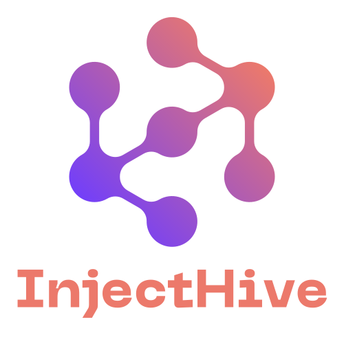
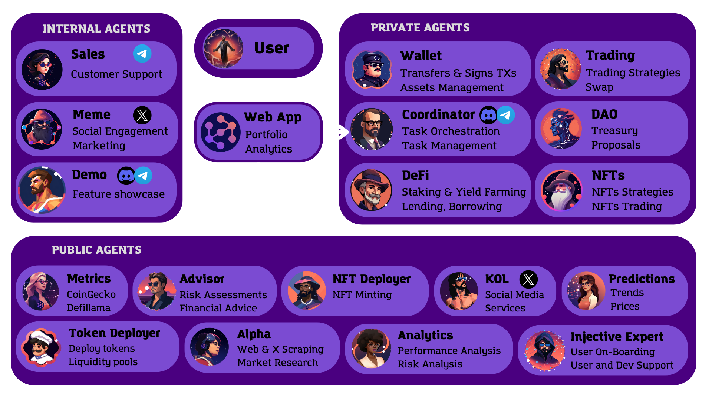
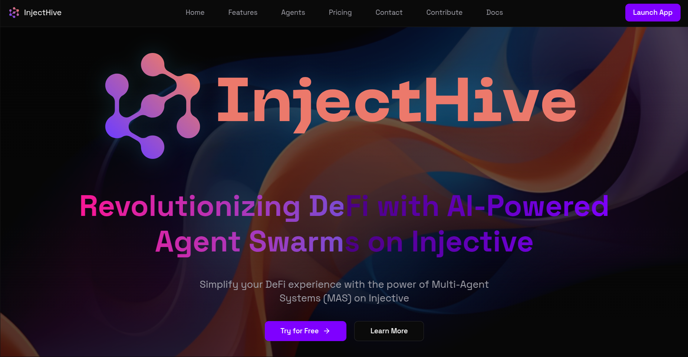

# InjectHive: Injective DeFi Agent Swarm


<div align="center">
  
  <h3>Revolutionizing Injective DeFi with AI-Powered Agent Swarms</h3>
  <p>Simplify your Injective DeFi experience with the power of Multi-Agent Systems (MAS)</p>
    <p align="center">
    <a href="https://discord.gg/xv7bcRpgUw">
      
    </a>
    <a href="https://x.com/InjectHiveAgent">
      
    </a>
    <a href="https://youtu.be/PLACEHOLDER">
      
    </a>
    <a href="https://linktr.ee/InjectHive>
      
    </a>
    <a href="https://injecthive.vercel.app/">
      
    </a>
    <a href="https://injecthive.gitbook.io">
      
    </a>
  </p>
  💥 Injective AI Agent Hackathon 💥
</div>


---

## 📚 Table of Contents

- [🌟 Overview](#-overview)
  - [Why Multi-Agent Systems (MAS)?](#why-multi-agent-systems-mas)
- [✨ Features](#-features)
  - [Core Features](#core-features)
  - [Injective Features](#injective-features)
  - [Web App Features](#️-web-app-features)
- [🧰 Tech Stack](#-tech-stack)
- [🤖 Agent Categories](#-agent-categories)
  - [Internal Agents (Platform Operations)](#-internal-agents-platform-operations)
  - [Public Agents (Shared Services)](#-public-agents-shared-services)
  - [Private Agents (Custom Deployments)](#-private-agents-custom-deployments)
- [🏠 Self-Hosting (Recommended)](#-self-hosting-recommended)
  - [Requirements for Self-Hosting](#requirements-for-self-hosting)
  - [Support](#support)
- [💎 Service Packages](#-service-packages)
- [🚀 Quick Start](#-quick-start)
  - [Prerequisites](#prerequisites)
  - [Installation](#installation)
  - [Configuration](#configuration)
  - [Running the Agent](#running-the-agent)
  - [Running the Web Client](#running-the-web-client)
- [🧪 How to use?](#-how-to-use)
- [🔍 Important Notes](#-important-notes)
- [🛠️ Development](#️-development)
  - [Project Structure](#project-structure)
- [🤝 Contributing](#-contributing)
- [📄 License](#-license)

## 🌟 Overview

InjectHive is an innovative open-source project revolutionizing the Injective DeFi landscape through AI-powered agent swarms. By employing a sophisticated multi-agent system, InjectHive streamlines and automates DeFi operations, offering users a seamless and efficient experience on Injective. Its modular design ensures scalability and adaptability, empowering users to navigate the complexities of DeFi with ease and confidence.

You can find detailed information in our [system overview](docs/overview.md), and [complete whitepaper](docs/whitepaper.md).

### Why Multi-Agent Systems (MAS)?

Our platform leverages a Multi-Agent System architecture where each agent specializes in specific tasks—from fetching metrics to executing trades—enabling modular, scalable, and efficient operations. This approach ensures:

- **🎯 Specialization**: Optimized performance through task-specific agents
- **📈 Scalability**: Easy addition of new agents and features
- **🛡️ Robustness**: Continued operation even if individual agents fail
- **⚡ Efficiency**: Parallel task execution for improved performance
- **🔄 Adaptability**: Seamless integration with new protocols and APIs

Learn more about our agent system in the [agents documentation](docs/agents.md).


<div align="center">
  
  <p><em>InjectHive Architecture</em></p>
</div>

## ✨ Features

### Core Features

- 💬 Natural language processing
- 🔍 RAG (Retrieval-Augmented Generation) Knowledge Base
- 🤖 Multi-Agent System (MAS): 18 AI Agents included.
- 🔅 Integrated Website & Web App
- 🛠️ Full-featured Discord, Twitter and Telegram connectors
- 🔗 Support for every model (Llama, Grok, OpenAI, Anthropic, etc.)
- 👥 Multi-agent and room support
- 📚 Easily ingest and interact with your documents
- 💾 Retrievable memory and document store
- 💰 Real-time prices using CoinGecko API
- 🚀 Real-time TVL using DefiLlama API
- 📊 Real-time Pools data using GeckoTerminal
- 📝 Text generation and analysis
- 🎨 Image generation and description
- 🗣️ Speech synthesis and recognition
- 📊 Data visualization
- 🌐 Web browsing capabilities
- 🚀 Highly extensible - create your own actions and clients

### Injective Features

- 💰 Wallet management and balance tracking
- 💸 Token transfers (INJ and other tokens on Injective)
- 🔍 Transaction and block explorer functionality
- 🏦 Staking operations and validator information
- 🗳️ Governance proposal tracking and participation
- 📊 Exchange operations and market data
- 📈 Real-time price tracking via CoinGecko integration
- 🌐 Network statistics and blockchain metrics
- 💹 DeFi protocol analytics via DefiLlama integration

### 🖥️ Web App Features
- 🚀 Landing page
- 🎨 Modern, responsive design
- 📄 Agents Directory
- 🤖 Chat with Agent Swarm through web interface
- 👛 Injective wallet connector
- 📊 Portfolio & Analytics dashboard (WIP)
- 📝 Transaction History (TBD)
- 🌐 Token Gating (TBD)

<div align="center">
  
  <p><em>InjectHive Web Client</em></p>
</div>

## 🧰 Tech Stack

- ElizaOS
- Vite
- TailwindCSS
- ShadcnUI
- Typescript
- Python
- NodeJS
- n8n (Workflow Automation and agent orchestration)


### 🤖 Agent Categories

For complete details about each agent's capabilities and use cases, see our [agents documentation](docs/agents.md).
#### 🏢 Internal Agents (Platform Operations)
1. 💼 Sales Agent: Customer relations and onboarding
2. 🎨 Meme Agent: Social media marketing agents promoting InjectHive
3. 🎮 Demo Agent: Interactive platform demonstration and feature showcase

#### 🌐 Public Agents (Shared Services)
4. 📊 Metrics Agent: Provides protocol TVL, prices, and performance metrics
5. 🔍 Alpha Agent: Market opportunities, Twitter and Web Scraping
6. 📈 Analyst Agent: Risks, performance, and market analysis
7. 🖼️ NFTs Agent: NFT intelligence and market analysis
8. 📣 KOL Agent: Social media service
9. 📝 Token Deployer: Token and liquidity pool deployment
10. 🎨 NFT Deployer: NFT Collection deployment
11. 🔷 Injective Expert: Documentation, resources, tips and advice for Injective users and devs
12. 🎮 Predictions Agent: Trend analysis and predictions

#### 🔒 Private Agents (Custom Deployments)
13. 🎨 Coordinator Agent: Advanced orchestration system implemented in n8n for multi-agent operations. Features voice and text interactions via Telegram, with the ability to delegate tasks to specialized agents across different frameworks.
14. 💱 DeFi Agent: Manages DeFi operations (Staking, etc.)
15. 📈 Trading Agent: Manages trading operations (position management, rebalancing, strategies, etc.)
16. 👛 Wallet Agent: Manages Injective wallet operations (Transfers, Signatures, etc.)
17. 🏛️ DAO Agent: Manages DAO operations (Treasury management, proposal management, DAO metrics, etc.)
18. 💡 Advisor Agent: Manages strategy planning and provides advice


## 🏠 Self-Hosting (Recommended)

InjectHive is and will always be open source! We strongly encourage users to self-host their own instance of InjectHive. This gives you full control over your data and agents while learning about the technology.

For detailed implementation guidance, see our [plugin documentation](docs/plugin.md).

### Requirements for Self-Hosting
- Server or cloud instance (e.g., AWS, DigitalOcean, or your local machine)
- API keys for required services.
- Basic knowledge of TypeScript/Node.js for customization

### Support
While self-hosting is a DIY approach, we provide:
- Detailed documentation
- Community support via Discord
- GitHub issues for bug reports
- Basic setup guidance

### Service Packages

> **Note**: The following service packages are not yet launched but will be available soon through early access. For now, we recommend self-hosting your own instance!

For detailed service descriptions and future offerings, see our [services documentation](docs/services.md).

## 🚀 Quick Start

### Prerequisites

- [Python 2.7+](https://www.python.org/downloads/)
- [Node.js 23+](https://docs.npmjs.com/downloading-and-installing-node-js-and-npm)
- [Git](https://git-scm.com/downloads)
- [pnpm](https://pnpm.io/installation)
- [n8n](https://docs.n8n.io/getting-started/installation/) (Required for Coordinator Agent)

> **Note for Windows Users:** [WSL 2](https://learn.microsoft.com/en-us/windows/wsl/install-manual) and [Visual Studio Build Tools](https://visualstudio.microsoft.com/downloads/) are required.

### Installation

```bash
# Clone the repository
git clone https://github.com/nicoware-dev/injecthive
cd injecthive/eliza

# Install dependencies
pnpm install --no-frozen-lockfile

# Copy environment file
cp .env.example .env
```

### Configuration

Edit `.env` file and add your credentials:

```env
# Required for Injective operations
INJECTIVE_PRIVATE_KEY=your_private_key_with_0x_prefix
INJECTIVE_NETWORK=Mainnet  # or Testnet

# Optional - for enhanced functionality
COINGECKO_API_KEY=your_coingecko_api_key
DEFILLAMA_API_KEY=your_defillama_api_key

# Choose an API provider and add the API_KEY on the env file
OPENAI_API_KEY=                # OpenAI API key, starting with sk-
ANTHROPIC_API_KEY=             # For Claude (optional)

# Client Configuration
DISCORD_APPLICATION_ID=        # Discord bot ID
DISCORD_API_TOKEN=             # Discord bot token
TELEGRAM_BOT_TOKEN=            # Telegram bot token
TWITTER_USERNAME=              # Twitter username
TWITTER_PASSWORD=              # Twitter password
TWITTER_EMAIL=                 # Twitter email
```

### Running the Agent

```bash
# Build the project
pnpm build

# Start a single agent (Recommended for testing)
pnpm start:debug --characters="characters/demo1-agent.character.json"

# Start demo agents (5)
pnpm start --characters="characters/demo-agent.character.json,characters/metrics-agent.character.json,characters/sales-agent.character.json,characters/meme-agent.character.json,characters/injective-expert-agent.character.json"

# Start all agents (18)
pnpm start --characters="characters/coordinator.character.json,characters/metrics-agent.character.json,characters/sales-agent.character.json,characters/meme-agent.character.json,characters/nfts-agent.character.json,characters/alpha-agent.character.json,characters/analyst-agent.character.json,characters/trading-agent.character.json,characters/wallet-agent.character.json,characters/dao-agent.character.json,characters/defi-agent.character.json,characters/demo-agent.character.json,characters/kol-agent.character.json,characters/token-deployer-agent.character.json,characters/nft-deployer-agent.character.json,characters/injective-expert-agent.character.json,characters/predictions-agent.character.json,characters/advisor-agent.character.json"
```

### Running the Web Client

In a new terminal, run the following command:

```bash
cd client
pnpm run dev
```

## 🧪 How to use?

For comprehensive usage examples and advanced features, see our [plugin documentation](docs/plugin.md).

Interact with the agents with these example prompts:


### Network Information
```
What is Injective?
```


### Web Search
```
Search the web for latest news on Injective and its Ecosystem
```


### TVL Metrics (DefiLlama)
```
Show me Injective's TVL
```
```
What are the top 5 protocols on Injective by TVL?
```
```
What's the tvl of hydro?
```
```
What's the tvl of helix?
```


### Price Metrics (CoinGecko)
```
Get prices for ETH, BTC and INJ
```
```
Get INJ price
```


### Wallet Operations
```
Show me my Injective wallet address and INJ balance
```
```
Show my portfolio
```


### Explorer Provider
```
Get info for wallet inj1caugpcrnxvh8k8us32294lsd3498x5qjwfg8rs
```
```
Show me network stats
```
```
Show me the latest blocks
```
```
Show me the latest transactions
```


### Transfers
```
Send 0.01 INJ to inj1nh9v5a5p524yy29dn0xgav5jm52dye28arfmz9
```
```
Send 0.01 USDT to inj1nh9v5a5p524yy29dn0xgav5jm52dye28arfmz9
```

### Trading (Work In Progress)
```
Swap 1 INJ for USDT
```
```
Swap 1 INJ for USDT on Helix
```


## 🔍 Important Notes

- Ensure you have sufficient funds for transaction fees.
- Always double-check addresses and amounts before executing transactions.


### Project Structure

```
README.md                             # This file
docs/                                 # Documentation
  ├── pitch-deck.pdf                      # InjectHive Pitch Deck
  ├── agents.md                           # Agents documentation
  ├── branding.md                         # Branding guidelines
  ├── contributing.md                     # Contribution guidelines
  ├── deployment.md                       # Deployment guide
  ├── faqs.md                            # Frequently Asked Questions
  ├── features.md                         # Features documentation
  ├── index.md                           # Documentation home
  ├── integrations.md                    # Integration guides
  ├── links.md                           # Important links
  ├── multi-agent-system.md              # MAS architecture details
  ├── n8n.md                             # n8n workflow documentation
  ├── overview.md                         # Project overview
  ├── plugin.md                          # Plugin documentation
  ├── quick-start.md                     # Quick start guide
  ├── self-hosting.md                    # Self-hosting instructions
  ├── services.md                        # Services documentation
  ├── system-overview.md                 # System architecture overview
  ├── user-guide.md                      # User guide
  ├── whitepaper.md                      # Project whitepaper
  └── resources/                         # Documentation resources
assets/                               # Branding Assets & Guidelines
eliza/                                # Eliza project
  ├── packages/
  │   ├── core/                       # Eliza core functionality
  │   ├── plugin-injecthive/              # Injective integration
  │   │   ├── src/
  │   │   │   ├── actions/      
  │   │   │   │   ├── erc20Transfer   # ERC20 Transfer Action
  │   │   │   │   ├── transfer-inj    # INJ Transfer Action
  │   │   │   │   └── portfolio       # Portfolio Action
  │   │   │   ├── providers/    
  │   │   │   │   ├── coingecko       # CoinGecko Provider
  │   │   │   │   ├── defillama       # DefiLlama Provider
  │   │   │   │   └── wallet          # Injective Wallet Provider
  │   │   │   └── ...
  │   │   ├── templates/    
  │   │   ├── types/        
  │   │   └── utils/        
  └── client/                         # Custom Web App
n8n/                       # n8n workflow configurations
  ├── coordinator-agent.json         # Main coordinator agent workflow
  ├── eliza-agent-tool.json         # Eliza agent integration
  ├── COORDINATOR_SYSTEM.md         # Coordinator system documentation
  └── other/                        # Additional workflow configurations
```

## 🤝 Contributing

1. Fork the repository
2. Create your feature branch
3. Commit your changes
4. Push to the branch
5. Create a Pull Request

## 📄 License

This project is licensed under the MIT License - see the [LICENSE](LICENSE) file for details.

---

<div align="center">
  <p>Built with ❤️ by the InjectHive team</p>
  <p>
    <a href="https://discord.gg/xv7bcRpgUw">
      
    </a>
    <a href="https://x.com/InjectHiveAgent">
      
    </a>
  </p>
</div>

